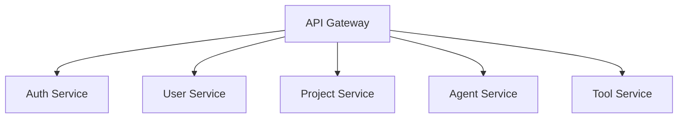
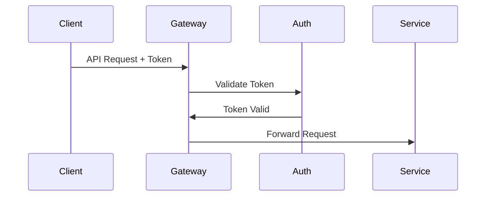

# API Documentation

## API Architecture

### Endpoint Structure

```mermaid
graph TD
    A[API Gateway] --> B[Auth Service]
    A --> C[User Service]
    A --> D[Project Service]
    A --> E[Agent Service]
    A --> F[Tool Service]
```

### Authentication Flow

```mermaid
sequenceDiagram
    participant Client
    participant Gateway
    participant Auth
    participant Service
    
    Client->>Gateway: API Request + Token
    Gateway->>Auth: Validate Token
    Auth->>Gateway: Token Valid
    Gateway->>Service: Forward Request
```

[Detailed API specifications continue...]