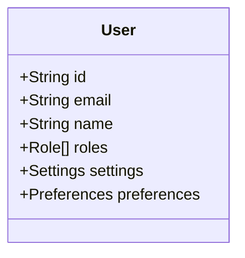
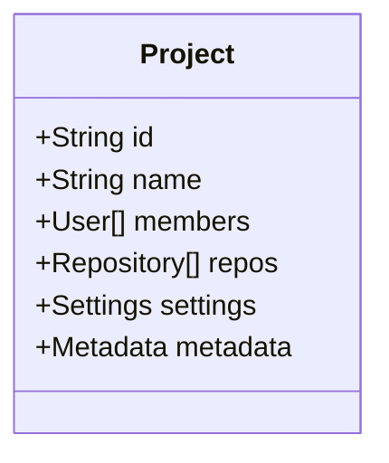

# Data Models and Schemas

## Core Data Models

### User Model

```mermaid
classDiagram
    class User {
        +String id
        +String email
        +String name
        +Role[] roles
        +Settings settings
        +Preferences preferences
    }
```

### Project Model

```mermaid
classDiagram
    class Project {
        +String id
        +String name
        +User[] members
        +Repository[] repos
        +Settings settings
        +Metadata metadata
    }
```

[Detailed data model specifications continue...]