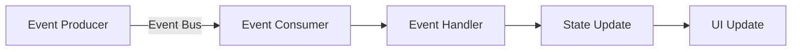
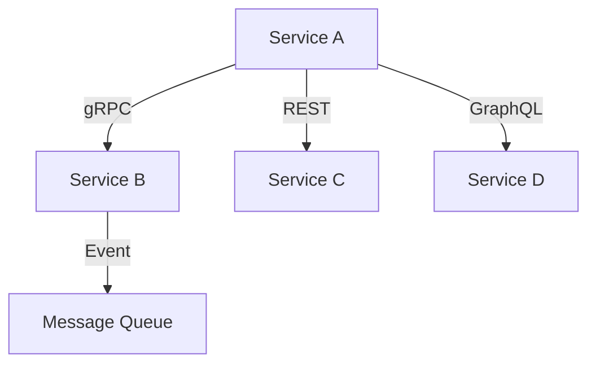

# Integration Patterns

## System Integration Architecture

### Event Flow

```mermaid
graph LR
    A[Event Producer] -->|Event Bus| B[Event Consumer]
    B --> C[Event Handler]
    C --> D[State Update]
    D --> E[UI Update]
```

### Service Communication

```mermaid
graph TD
    A[Service A] -->|gRPC| B[Service B]
    A -->|REST| C[Service C]
    A -->|GraphQL| D[Service D]
    B -->|Event| E[Message Queue]
```

[Detailed integration specifications continue...]