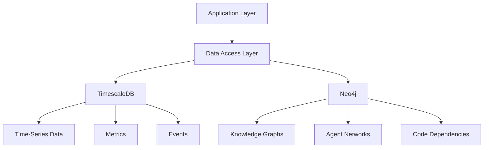
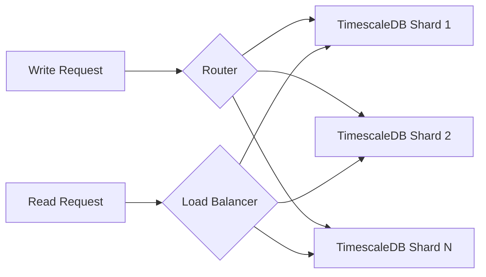
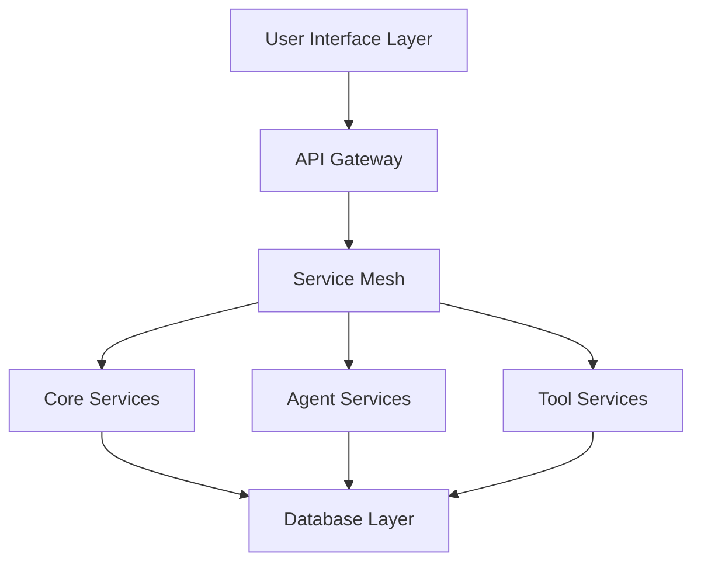
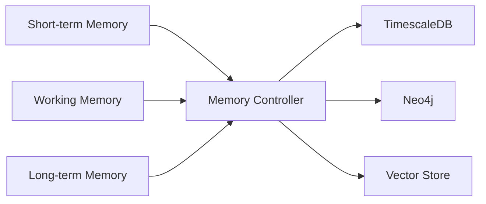

# Core Architecture: Ultimate Agentic Platform

## Database Architecture

### Migration from MongoDB to Distributed TimescaleDB + Neo4j

We're transitioning from MongoDB to a hybrid solution:

1. **TimescaleDB (Primary Storage)**
   - Handles time-series data and metrics
   - Better performance for analytical queries
   - Native compression and partitioning
   - Automatic data retention policies
   - PostgreSQL compatibility
   - Hypertables for efficient time-based queries

2. **Neo4j (Graph Database)**
   - Stores relationship-heavy data
   - Agent interaction graphs
   - Knowledge graphs
   - Code dependency graphs
   - Team/project relationships

### Data Distribution Strategy

[Continue with extensive database details...]

## System Architecture

### High-Level Overview

[Continue with detailed system architecture...]

## Memory Architecture

### Distributed Memory System

[Continue with memory system details...]