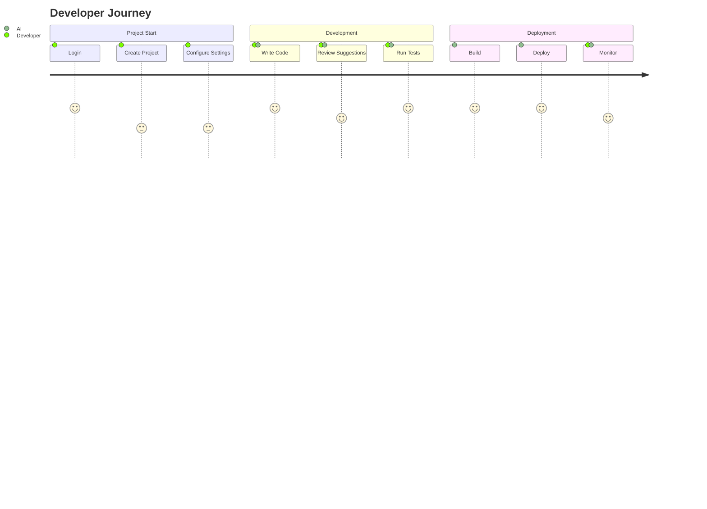
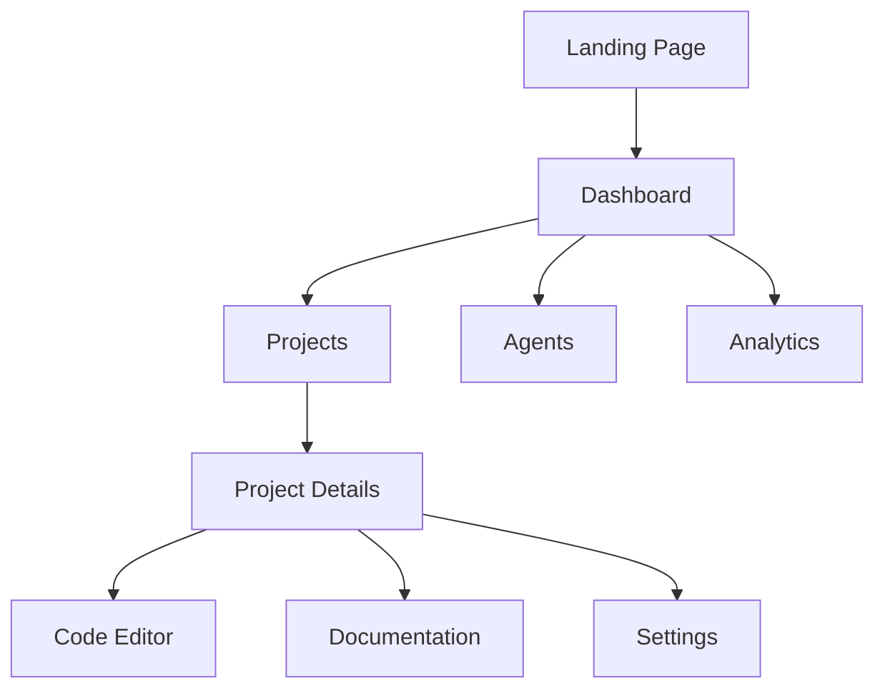

# User Flows and Interface Architecture

## User Journey Maps

### Developer Flow

```mermaid
journey
    title Developer Journey
    section Project Start
        Login: 5: Developer
        Create Project: 3: Developer
        Configure Settings: 3: Developer
    section Development
        Write Code: 5: Developer, AI
        Review Suggestions: 4: Developer, AI
        Run Tests: 5: Developer, AI
    section Deployment
        Build: 5: AI
        Deploy: 5: AI
        Monitor: 4: Developer, AI
```

[Continue with all user flows...]

## Page Tree Structure

```mermaid
graph TD
    A[Landing Page] --> B[Dashboard]
    B --> C[Projects]
    B --> D[Agents]
    B --> E[Analytics]
    C --> F[Project Details]
    F --> G[Code Editor]
    F --> H[Documentation]
    F --> I[Settings]
```

[Continue with detailed page structures...]