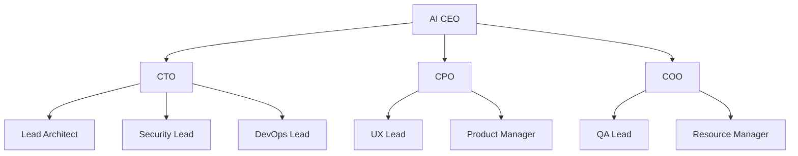
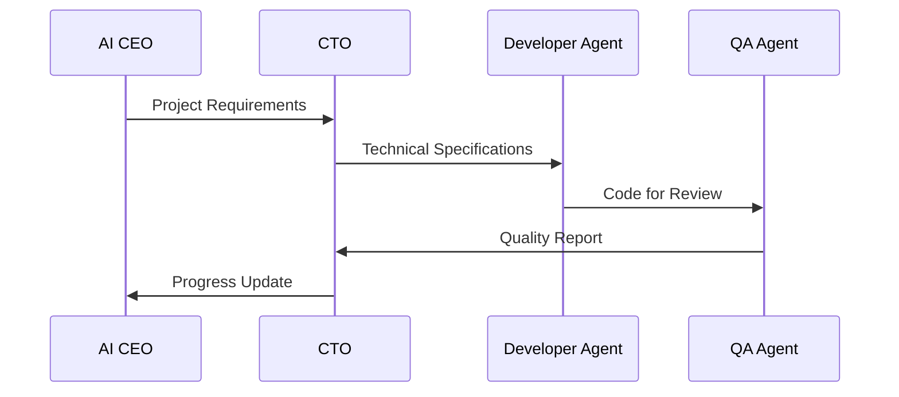

# Agent Architecture and Orchestration

## Agent Hierarchy

```mermaid
graph TD
    A[AI CEO] --> B[CTO]
    A --> C[CPO]
    A --> D[COO]
    B --> E[Lead Architect]
    B --> F[Security Lead]
    B --> G[DevOps Lead]
    C --> H[UX Lead]
    C --> I[Product Manager]
    D --> J[QA Lead]
    D --> K[Resource Manager]
```

[Continue with agent details...]

## Agent Communication Protocols

```mermaid
sequenceDiagram
    participant CEO as AI CEO
    participant CTO as CTO
    participant Dev as Developer Agent
    participant QA as QA Agent
    
    CEO->>CTO: Project Requirements
    CTO->>Dev: Technical Specifications
    Dev->>QA: Code for Review
    QA->>CTO: Quality Report
    CTO->>CEO: Progress Update
```

[Continue with communication protocols...]