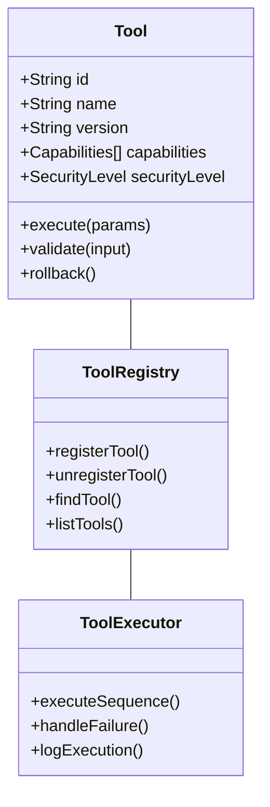

# Tool Integration Architecture

## Core Tool System

### Tool Registry Structure

### Integration Points
- VSCode Extension
- JetBrains Plugin Suite
- CLI Interface
- Web Interface
- API Endpoints
- Git Hooks
- CI/CD Pipeline Hooks

[Detailed tool specifications continue...]