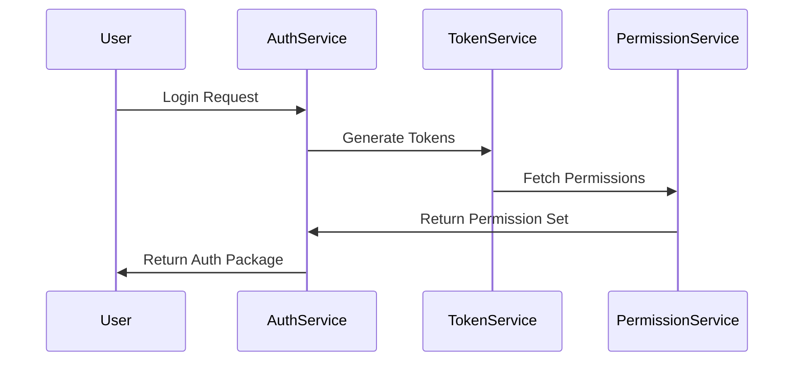

# Security and Compliance Framework

## Security Architecture

### Authentication Flow

### Compliance Monitoring
- SOC 2 Compliance
- GDPR Requirements
- HIPAA Compatibility
- ISO 27001 Standards

[Detailed security specifications continue...]