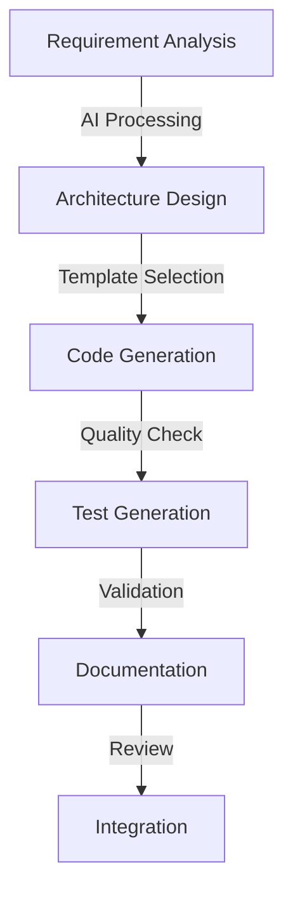
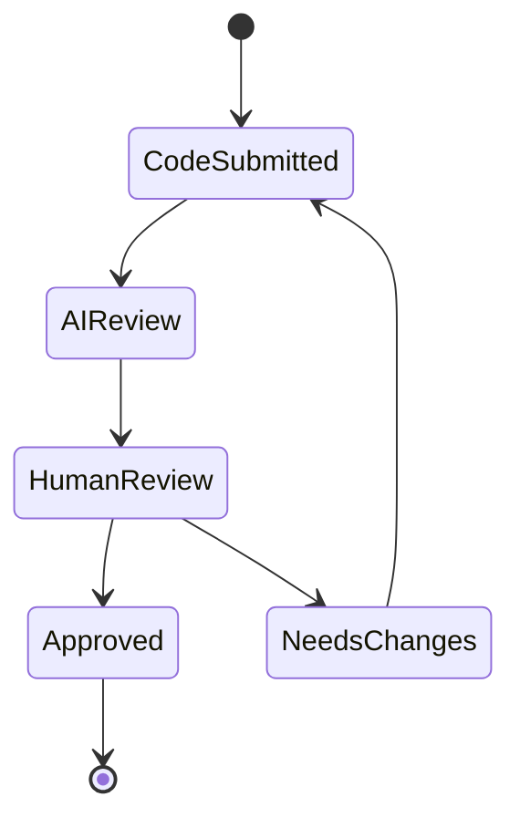

# Development Workflows

## Automated Development Pipeline

### Code Generation Flow

```mermaid
graph TD
    A[Requirement Analysis] -->|AI Processing| B[Architecture Design]
    B -->|Template Selection| C[Code Generation]
    C -->|Quality Check| D[Test Generation]
    D -->|Validation| E[Documentation]
    E -->|Review| F[Integration]
```

### Review Process

```mermaid
stateDiagram-v2
    [*] --> CodeSubmitted
    CodeSubmitted --> AIReview
    AIReview --> HumanReview
    HumanReview --> Approved
    HumanReview --> NeedsChanges
    NeedsChanges --> CodeSubmitted
    Approved --> [*]
```

[Detailed workflow specifications continue...]