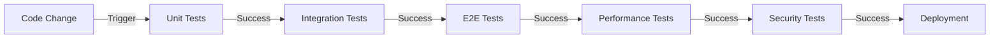

# Testing and Quality Assurance

## Testing Architecture

### Test Pyramid Implementation
```mermaid
pyramid-schema
    title Test Distribution
    unit: 70
    integration: 20
    e2e: 10
```

### Automated Testing Flow


[Detailed testing specifications continue...]