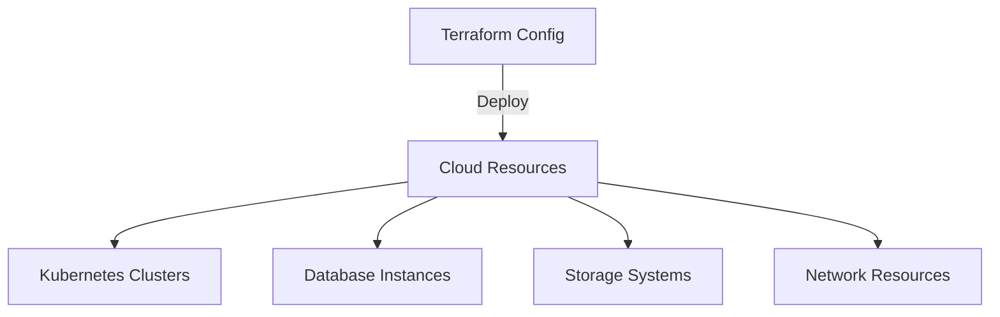
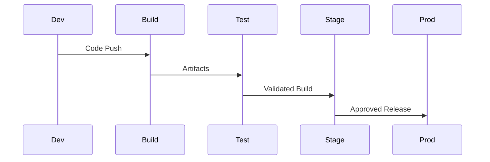

# Deployment and Infrastructure

## Cloud Architecture

### Infrastructure as Code

```mermaid
graph TD
    A[Terraform Config] -->|Deploy| B[Cloud Resources]
    B --> C[Kubernetes Clusters]
    B --> D[Database Instances]
    B --> E[Storage Systems]
    B --> F[Network Resources]
```

### Deployment Pipeline

```mermaid
sequenceDiagram
    participant Dev
    participant Build
    participant Test
    participant Stage
    participant Prod
    
    Dev->>Build: Code Push
    Build->>Test: Artifacts
    Test->>Stage: Validated Build
    Stage->>Prod: Approved Release
```

[Detailed deployment specifications continue...]