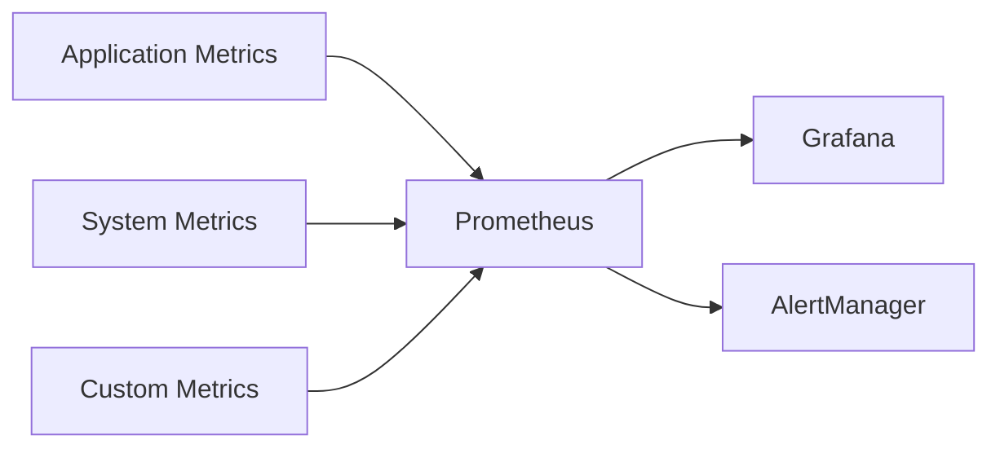
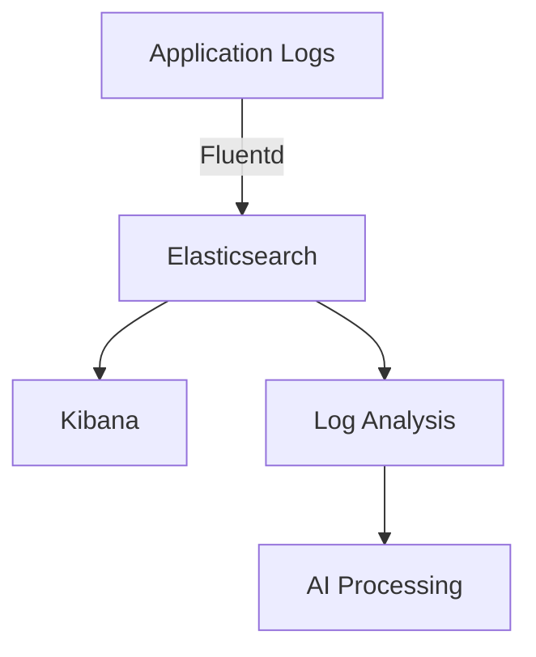

# Monitoring and Analytics

## Observability Stack

### Metrics Collection

```mermaid
graph LR
    A[Application Metrics] --> B[Prometheus]
    C[System Metrics] --> B
    D[Custom Metrics] --> B
    B --> E[Grafana]
    B --> F[AlertManager]
```

### Log Management

```mermaid
graph TD
    A[Application Logs] -->|Fluentd| B[Elasticsearch]
    B --> C[Kibana]
    B --> D[Log Analysis]
    D --> E[AI Processing]
```

[Detailed monitoring specifications continue...]