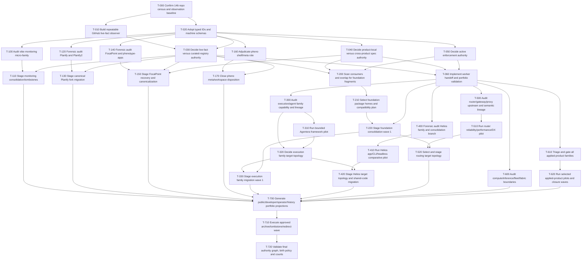

# Initial WBS, PERT, and dependency DAG

## Estimate warning

All estimates are three-point **agent-hour planning estimates**, not measured delivery commitments.

PERT expected value:

\[
E = (O + 4M + P) / 6
\]

The computed critical path below assumes unlimited parallel workers and no resource contention. It therefore excludes reviewer bottlenecks, human decisions, platform hardware, API limits, CI queues, and migration windows.

## Dependency-only critical path

**Expected length:** 605.00 agent-hours  
**Path:** T-000 → T-020 → T-040 → T-060 → T-610 → T-620 → T-700 → T-710 → T-720

The long applied-product closure task dominates this initial aggregate model. In practice it will be decomposed by family and product; this path is a portfolio-level placeholder, not one monolithic task assignment.

## Task table

| ID | Phase | Work | Predecessors | O/M/P hours | PERT | Initial status |
|---|---|---|---|---|---:|---|
| T-000 | P0 | Confirm 146-repo census and observation baseline | — | 4/8/16 | 8.67 | DONE |
| T-010 | P0 | Build repeatable GitHub live-fact observer | T-000 | 6/16/32 | 17.00 | READY |
| T-020 | P0 | Adopt typed IDs and machine schemas | T-000 | 4/10/20 | 10.67 | READY |
| T-030 | P1 | Decide live-fact versus curated-registry authority | T-010,T-020 | 8/20/40 | 21.33 | BLOCKED_DECISION |
| T-040 | P1 | Decide product-local versus cross-product spec authority | T-020 | 10/28/56 | 29.67 | BLOCKED_DECISION |
| T-050 | P1 | Decide active enforcement authority | T-020 | 8/20/40 | 21.33 | BLOCKED_DECISION |
| T-060 | P1 | Implement worker handoff and portfolio validation | T-030,T-040,T-050 | 8/20/40 | 21.33 | BLOCKED |
| T-100 | P2 | Audit vibe monitoring micro-family | T-020 | 6/14/28 | 15.00 | READY |
| T-110 | P2 | Stage monitoring consolidation/tombstones | T-100,T-030 | 8/20/40 | 21.33 | BLOCKED |
| T-120 | P2 | Forensic audit Planify and Planify2 | T-020 | 16/40/80 | 42.67 | READY |
| T-130 | P2 | Stage canonical Planify fork migration | T-120,T-030 | 16/36/72 | 38.67 | BLOCKED |
| T-140 | P2 | Forensic audit FocalPoint and phenotype-apps | T-020 | 24/64/128 | 68.00 | READY |
| T-150 | P2 | Stage FocalPoint recovery and canonicalization | T-140,T-030,T-040 | 24/64/128 | 68.00 | BLOCKED |
| T-160 | P2 | Adjudicate pheno shelf/meta role | T-020 | 4/12/24 | 12.67 | READY |
| T-170 | P2 | Close pheno meta/workspace disposition | T-160,T-030 | 6/14/28 | 15.00 | BLOCKED |
| T-200 | P3 | Scan consumers and overlap for foundation fragments | T-030,T-040,T-050 | 24/64/128 | 68.00 | BLOCKED |
| T-210 | P3 | Select foundation package homes and compatibility plan | T-200 | 16/40/80 | 42.67 | BLOCKED |
| T-220 | P3 | Stage foundation consolidation wave 1 | T-210,T-060 | 32/96/192 | 101.33 | BLOCKED |
| T-300 | P4 | Audit execution/agent family capability and lineage | T-060 | 32/96/192 | 101.33 | BLOCKED |
| T-310 | P4 | Run bounded Agentora framework pilot | T-300 | 32/72/144 | 77.33 | BLOCKED |
| T-320 | P4 | Decide execution family target topology | T-300,T-310 | 16/48/96 | 50.67 | BLOCKED_DECISION |
| T-330 | P4 | Stage execution family migration wave 1 | T-320,T-220 | 48/120/240 | 128.00 | BLOCKED |
| T-400 | P4 | Forensic audit Helios family and consolidation branch | T-060 | 32/96/192 | 101.33 | BLOCKED |
| T-410 | P4 | Run Helios app/CLI/headless comparative pilot | T-400 | 32/80/160 | 85.33 | BLOCKED |
| T-420 | P4 | Stage Helios target topology and shared-code migration | T-410,T-320 | 32/80/160 | 85.33 | BLOCKED |
| T-500 | P5 | Audit router/gateway/proxy upstream and semantic lineage | T-060 | 48/128/256 | 136.00 | BLOCKED |
| T-510 | P5 | Run router reliability/performance/DX pilot | T-500 | 40/96/192 | 102.67 | BLOCKED |
| T-520 | P5 | Select and stage routing target topology | T-510,T-220 | 24/64/128 | 68.00 | BLOCKED |
| T-600 | P6 | Audit compute/inference/fleet/fabric boundaries | T-060 | 48/128/256 | 136.00 | BLOCKED |
| T-610 | P7 | Triage and gate all applied-product families | T-060 | 48/120/240 | 128.00 | BLOCKED |
| T-620 | P7 | Run selected applied-product pilots and closure waves | T-610 | 80/240/480 | 253.33 | BLOCKED |
| T-700 | P8 | Generate public/developer/operator/history portfolio projections | T-110,T-130,T-150,T-170,T-330,T-420,T-520,T-600,T-620 | 20/48/96 | 51.33 | BLOCKED |
| T-710 | P8 | Execute approved archive/tombstone/redirect wave | T-700 | 24/64/128 | 68.00 | BLOCKED |
| T-720 | P8 | Validate final authority graph, birth policy and counts | T-710 | 12/32/64 | 34.00 | BLOCKED |

## DAG

## Scheduling policy

- Run `T-010`, `T-020`, `T-100`, `T-120`, `T-140`, and `T-160` in bounded parallel lanes.
- Do not execute migration tasks until authority decisions and worker validation exist.
- Split `T-620` into one task group per applied-product family after triage.
- Re-estimate from measured audit velocity after the first three closure units.
- Maintain a resource-constrained schedule separately.
- Human-decision tasks cannot be “parallelized away” by more agents.
