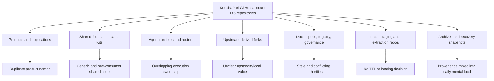
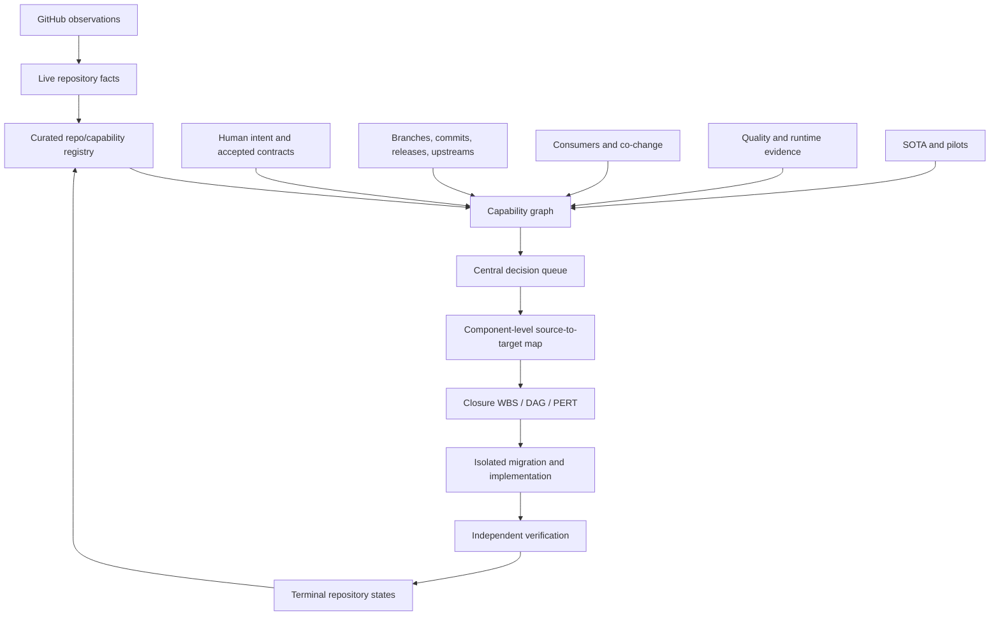
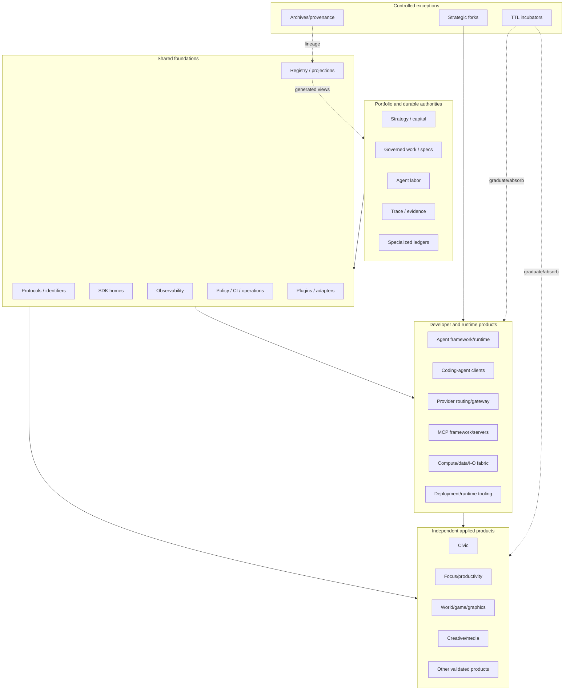
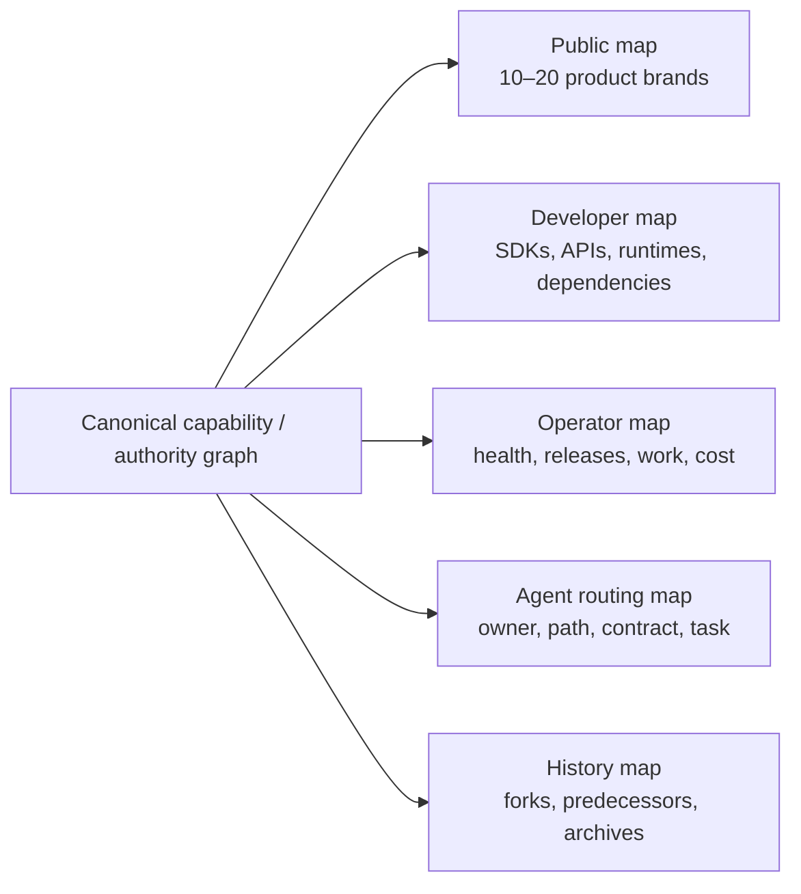
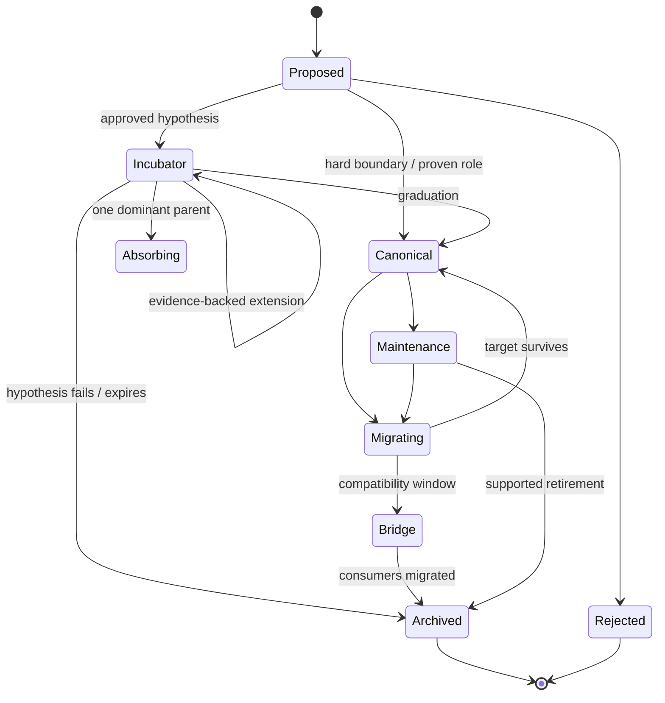
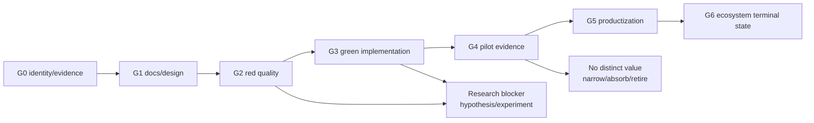

# Before, transition, and after maps

## Before: flat namespace with mixed semantics

This view does not say every repository is bad. It shows that a flat namespace provides no reliable semantics.

## Transition: capability and authority control plane

## After: layered bounded polyrepo

## Audience projections

## Repository lifecycle

## Capability maturity

## Key structural effect

The target reduces daily complexity in three ways:

1. Archives and forks remain discoverable but leave the default active-product view.
2. Shared capabilities have one authority, even when several implementations/adapters exist.
3. Large repositories expose enforced internal packages and scoped build/test targets so an agent can own a bounded area without loading the entire repo.
