# KooshaPari Portfolio Rationalization and Completion Operating System

**Date:** 2026-09-01  
**Account:** `KooshaPari`  
**Scope:** all 146 owner repositories, without excluding forks, private repositories, or archived repositories  
**Decision maturity:** portfolio triage plus targeted root-document review; irreversible actions remain gated

---

## 0. Executive verdict

The portfolio does not primarily have a “146 repositories” problem. It has an **authority, identity, lifecycle, and evidence problem**.

A large polyrepo can be manageable when every repository has one defensible job, one lifecycle owner, explicit relationships, and machine-reconciled state. A much smaller portfolio can remain impossible to manage when names, READMEs, package identities, successor claims, branches, and GitHub archive flags contradict one another. The current account contains both:

- strong independent products and tools that should survive;
- legitimate narrow forks/adapters that deserve separate provenance and release boundaries;
- generic umbrellas and repo-of-repos shelves that should not survive;
- repositories that already declare themselves superseded or archived while GitHub still marks them active;
- repositories whose stated successor does not exist;
- repositories whose root document contains multiple incompatible product identities;
- duplicated portfolio authorities that cannot all be authoritative.

### Recommended target

Do **not** force the account to 50 repositories. That would reward count reduction over boundary correctness and would likely destroy useful products, adapters, research lineages, and provenance.

Use four separate counts:

| Surface | Recommended count | Meaning |
|---|---:|---|
| Managed canonical or narrowly transitional repositories | **63** | Product, platform, library, ledger, generated surface, or narrowed transition repo with active ownership |
| Time-boxed incubators and forensic holds | **15** | May promote or die; they are not allowed to linger indefinitely |
| Frozen upstream/reference or historical showcase repositories | **13** | Read-only inputs, contribution forks, or portfolio history; no standing feature agents |
| Repositories retired after migration/closure gate | **55** | Archived/tombstoned after parity, provenance, consumer, and redirect checks |
| **Actionable agent-owned set** | **78** | The number that should drive workload planning instead of 146 |

The expected steady state is therefore roughly **70–80 actively managed repositories**, with frozen references and archives outside normal agent WIP. This meets the requested 50–100 operating range without pretending every historical Git repository must be deleted.

### Evidence honesty

This pass accounts for **146/146 repositories** at GitHub metadata level. It includes **108 root-document reviews (E1)** and **38 metadata/name-only hypotheses (E0)**. It does **not** claim that all branches, tags, commits, packages, dependency graphs, builds, tests, releases, or live journeys were reproduced. No archive, deletion, destructive history rewrite, or public “complete” claim is authorized until the relevant repository reaches the required evidence tier.

---

## 1. What in the original operating idea is right—and what is not

### 1.1 Correct: incubation benefits from a separate repository

A new, uncertain capability often benefits from an isolated repository because it receives:

- a clean problem statement;
- a small dependency graph;
- independent experimentation;
- explicit provenance;
- a narrow agent context;
- a reversible path to promotion, absorption, or death.

That is a valid **incubation pattern**.

It is not automatically a valid permanent topology. Every incubator needs a promotion or sunset trigger. Otherwise, “micro-program first” becomes a machine that continuously creates permanent coordination debt.

### 1.2 Incorrect: “every layer must independently describe everything”

Documentation, tests, code, telemetry, and evidence should each cover the system, but they should not duplicate the full system verbatim.

The correct requirement is **semantic closure through typed links**:

- documentation explains intent, constraints, trade-offs, and contracts;
- tests encode falsifiable behavior and invariants;
- code implements the contracts;
- telemetry exposes runtime truth;
- evidence binds claims to immutable executions;
- traceability proves that every required concept is represented across the graph.

Copying the same prose into every layer creates drift. A requirement should have one canonical definition and many typed references.

### 1.3 Incorrect as written: “not worse in any single way”

Taken literally, this is unfalsifiable and usually impossible. Products occupy trade-off surfaces. A system can be faster but use more memory; safer but less flexible; easier to operate but less extensible.

Replace the absolute rule with the **Dominance and Trade-off Contract**:

1. Declare the comparator class before implementation.
2. Mark dimensions as **mandatory**, **tradeable**, or **irrelevant** for the target job.
3. Permit no regression in mandatory dimensions such as correctness, data integrity, security, privacy, and contractual compatibility.
4. Permit a regression in a tradeable dimension only when it is quantified, compensated by a material gain, and explicitly accepted in an ADR.
5. Require at least one material, user-valued differentiator supported by E4 evidence.
6. If no direct incumbent exists, compare against:
   - the current manual workflow;
   - doing nothing;
   - a composition of lower-level primitives;
   - the nearest adjacent category;
   - an internal predecessor.

A product that is identical in every material dimension fails. A product that is slightly different in a decorative dimension also fails.

### 1.4 Incomplete: “finish the easiest repositories first”

The smallest repository is not always the best next repository. The correct first work is the smallest **closure unit with the highest portfolio leverage**.

For example, normalizing a dead scaffold is useful, but making RepoLedger authoritative unlocks every subsequent archive, migration, dashboard, agent assignment, and drift check. Therefore the sequence is:

1. establish the control plane;
2. close zero-code lifecycle contradictions;
3. complete parity-backed absorptions;
4. resolve identity collisions;
5. finish narrowly bounded HMVPs;
6. run differentiating pilots.

### 1.5 Incorrect: “one agent owns an entire repository”

An agent may be accountable for repository closure, but work should be assigned to the smallest independently verifiable capability. Large repositories need internal ownership cells with enforced boundaries. The human or coordinator owns the repository-wide contract; agents own bounded changes against that contract.

---

## 2. Core definitions

| Term | Meaning |
|---|---|
| **Product** | A sustained user-facing value proposition with a primary journey, distribution path, support boundary, and success metrics |
| **Program** | A coordinated set of products/projects pursuing a broader outcome |
| **Project** | A bounded body of work with an end condition; it may or may not deserve a permanent repository |
| **Repository** | A versioning, provenance, access, release, and collaboration boundary—not a synonym for product |
| **Package/crate/module** | A distributable or internally versioned code unit; it may live in a monorepo |
| **Service/runtime** | A deployable failure and operations boundary |
| **Authority** | The one canonical owner of a concept, schema, decision, or state |
| **Projection** | A generated human or machine view of an authority; it must not become a competing truth |
| **Ledger** | A narrow append-oriented authority for one class of facts |
| **Evidence** | Immutable data sufficient to support a claim at a specific commit and environment |
| **Ecosystem** | A graph of products and tools connected by contracts, shared users, or a coherent philosophy |
| **Semantic ecosystem** | Products that need not interoperate directly but share recognizable design principles |
| **Literal ecosystem** | Products that exchange contracts, data, packages, events, or operational dependencies |

### Repository lifecycle states

Only these states are permitted:

- `canonical`: active authority with completed boundary contract;
- `incubator`: time-boxed experiment with promotion/sunset criteria;
- `transition`: source or target in a bounded migration;
- `reference`: frozen upstream fork, comparator, or dependency source;
- `generated`: derived registry/site/dashboard with no independent truth;
- `historical`: immutable provenance/showcase;
- `archived`: closed and excluded from active work;
- `quarantine`: role cannot be established safely; no feature work.

A README word such as “active,” a badge, or a hand-written percentage does not set lifecycle state. RepoLedger plus verified GitHub metadata does.

---

## 3. Portfolio objective: cubeify width and depth

The user’s “cubeify” intuition can be formalized as minimizing total coordination cost:

```text
C_total =
    C_intra_repo(context size, coupling, build fan-out, domain count)
  + C_inter_repo(edge count, release coordination, contract churn)
  + C_authority(duplicate truths, identity ambiguity, stale successors)
  + C_transition(migration risk, history loss, consumer breakage)
  + C_operation(CI, security, releases, issue queues, dependencies)
```

The optimum is not the fewest repositories. It is the topology with the lowest total cost subject to preserving product value, provenance, safety, and agent comprehensibility.

### Context-load acceptance test

A permanent repository is too large when a competent agent cannot, within one bounded working context:

1. identify the canonical charter and primary journey;
2. identify the target capability and its dependencies;
3. run the relevant build and focused test;
4. understand all contracts it may break;
5. produce a reviewable patch without loading unrelated domains.

A large repository may survive when its internal modules have:

- enforceable dependency boundaries;
- independent build/test commands;
- clear owners and interfaces;
- limited cross-module changes;
- generated architecture and dependency views;
- no shared “god” configuration or global state that defeats isolation.

### Hard separate-repository signals

A capability has strong pressure for a separate repository when at least two of these are true:

- independent release/version/support cadence;
- distinct security, privacy, or access boundary;
- distinct runtime/deployment/failure domain;
- multiple independent consumers;
- external protocol or schema authority;
- materially different user/persona and primary journey;
- independent upstream/fork provenance and sync lifecycle;
- separate contributor/community boundary;
- independent legal/license constraints.

### Hard merge/absorption signals

A capability has strong pressure to merge when several are true:

- same primary journey and release train;
- high historical co-change;
- duplicated contracts or package identities;
- no independent consumers;
- no independent deployment or security boundary;
- tiny scope with no credible roadmap;
- one repo merely mirrors another language implementation without distribution value;
- cross-repo coordination exceeds internal modularity cost.

### Split triggers

Split or extract when:

- one repository contains more than three weakly coupled domain clusters;
- different modules serve different users and release schedules;
- security or access boundaries differ;
- failures must be isolated;
- independent products are buried under one brandless umbrella;
- the repository cannot pass the context-load acceptance test.

---

## 4. Evidence tiers and the right to claim completion

| Tier | Required evidence | What may be claimed |
|---|---|---|
| **E0 — inventory** | Repository metadata, visibility, archive flag, name, default branch | “Repository exists and is classified provisionally” |
| **E1 — declared intent** | Root docs, charter, status claims, visible successor and upstream statements | “The repository declares X” |
| **E2 — forensic truth** | All branches/tags, code inventory, dependency graph, package metadata, history, provenance, consumers, unique assets | “The recovered role and migration map are evidence-backed” |
| **E3 — reproducible verification** | Clean clone, deterministic setup, build, tests, lint, typecheck, security, package/release checks | “This commit satisfies the machine gate in this environment” |
| **E4 — comparative pilot** | Controlled task corpus against incumbents, failure injection, metrics, evidence bundle | “This implementation has the measured advantages and trade-offs shown” |
| **E5 — operational/adoption** | Real users/consumers, sustained telemetry, incidents, support, releases, retention or usage evidence | “This product is proven in operation” |

No agent may convert an E1 percentage or README assertion into an E3/E4/E5 claim.

---

## 5. Completeness vector

Every candidate canonical repository receives a 0–4 score on eight independent axes:

| Axis | Question |
|---|---|
| **I — Identity** | Is the user, problem, product/project/program role, boundary, and non-goal unambiguous? |
| **A — Artifacts** | Are charter, intent, SOTA, PRD/spec, ADRs, research, threat model, compatibility, migration, and runbooks complete where applicable? |
| **V — Verification** | Can every required behavior and invariant be machine-validated with honest failure behavior? |
| **C — Code** | Is the required implementation present, cohesive, maintainable, and free of known critical placeholders? |
| **O — Operations** | Are install, packaging, release, deployment, rollback, observability, support, and lifecycle real? |
| **E — Evaluation** | Is there a fair pilot against incumbents/manual composition and a material differentiator? |
| **T — Traceability** | Can every important claim be traversed from job to evidence and back? |
| **B — Boundary fitness** | Does the repository have an optimal permanent boundary in the portfolio? |

Do not average away a zero. A repository with excellent code and no identity is not 75% complete. It is blocked.

### Maturity gates

**Documentation-ready**

- `I = 4`
- `A >= 3`
- `B >= 3`
- all assumptions are explicit;
- all alternatives are named;
- planned and implemented behavior are visually and machine-distinguishable;
- no contradictory canonical documents.

**Red-ready**

- every mandatory requirement has at least one test or validator;
- tests can fail for the intended reason;
- contracts and fixtures exist before implementation where appropriate;
- quality, security, and packaging gates are wired;
- no silent skip is permitted for a mandatory gate.

**Green-ready**

- implementation passes red gates on a clean environment;
- negative, boundary, compatibility, migration, and failure-injection tests pass;
- no critical placeholder or generated fiction remains;
- evidence is bound to commit, environment, and command output.

**Minimum Honest Viable Product (HMVP)**

- one real primary journey works end to end;
- clean installation is documented and reproduced;
- failure behavior and rollback are demonstrated;
- package/release/deployment claims are true;
- one comparator pilot exists;
- every public claim is supported at E3 or explicitly labeled planned;
- no critical security, data integrity, or licensing unknown is open.

---

## 6. Canonical traceability graph

Use typed identifiers rather than duplicated prose:

```text
JOB-*          user job / outcome
  ↓ realizes
CAP-*          capability
  ↓ specified by
REQ-*          functional / non-functional requirement
  ↓ constrained by
ADR-*          decision and rejected alternatives
  ↓ exposed by
API-* / SCHEMA-* / EVENT-*
  ↓ verified by
TEST-* / CHECK-* / JOURNEY-*
  ↓ implemented by
CODE-*         module, package, service, config
  ↓ observed by
TELEM-*        logs, metrics, traces, events
  ↓ captured in
EVID-*         immutable evidence bundle
  ↓ released as
REL-*          package/build/deployment
  ↓ evaluated in
CASE-*         pilot/case study
```

Every edge must be queryable. A Markdown link alone is insufficient for fleet validation; store the graph in a versioned machine manifest and render human views from it.

### Coverage requirements

Track at least four different coverages:

- **requirements coverage:** mandatory requirements linked to executable checks;
- **risk coverage:** identified hazards linked to prevention/detection/recovery tests;
- **contract coverage:** public API/schema/event compatibility cases;
- **code coverage:** statement/branch/mutation or language-appropriate implementation coverage.

High line coverage with missing requirement or risk coverage is not acceptable.

---

## 7. Documentation and artifact contract

Not every repository needs every document as a separate file, but every applicable semantic role must exist exactly once.

### Mandatory for every canonical product or platform

- `CHARTER.md` — identity, users, jobs, scope, non-goals, authority, lifecycle;
- `STATUS.yaml` — generated evidence-based state, not prose percentage;
- `README.md` — truthful orientation and first verified journey;
- `PRD.md` or product section — user outcomes and success measures;
- `SPEC.md` — behavioral and non-functional contract;
- `ARCHITECTURE.md` — components, dependencies, data/control flow, failure domains;
- `FUNCTIONAL_REQUIREMENTS.md` or machine requirements file;
- `TRACEABILITY.yaml`;
- `SECURITY.md` plus threat model when risk warrants;
- `COMPATIBILITY.md`;
- `OPERATIONS.md` or runbooks;
- `MIGRATION.md` when predecessors/consumers exist;
- `CHANGELOG.md`;
- `LICENSE` and third-party notices;
- `EVIDENCE.md` linking immutable verification and pilot bundles.

### Conditional artifacts

- `UPSTREAM.md`, `DELTA.md`, `SYNC.md`, `EXIT.md` for forks;
- `PROTOCOL.md` and conformance matrix for protocol owners;
- `DATA_GOVERNANCE.md` for persistent or sensitive data;
- `MODEL_CARD.md` / dataset cards for ML;
- `ACCESSIBILITY.md` for user interfaces;
- `RELEASE.md` for distributed artifacts;
- `DEPRECATION.md` and tombstone for retirement;
- `RESEARCH.md` / `SOTA.md` for novel or research-heavy work;
- `CASE_STUDIES/` for E4 pilots.

### Source-of-truth hierarchy

1. human-approved portfolio decision;
2. RepoLedger machine state;
3. repository charter and accepted ADRs;
4. executable contracts/tests;
5. code and runtime evidence;
6. generated README/status/docs projections;
7. historical prose.

A lower item may reveal that a higher item is stale, but it does not silently replace it. It opens a decision.

---

## 8. Quality, stability, and security contract

The baseline must be risk- and language-aware, but every canonical repository needs:

- deterministic environment/toolchain declaration;
- format and lint checks;
- compile/type checks;
- unit, integration, contract, and journey tests as applicable;
- negative and failure-path tests;
- dependency and license review;
- secret scanning;
- static analysis;
- reproducible packaging/build;
- artifact provenance and checksums/signatures where distributed;
- SBOM for shipped binaries/services;
- rollback or disable path;
- observability contract;
- test evidence bound to commit SHA;
- no mandatory check that silently skips because a tool or credential is absent.

### Additional requirements by class

**Libraries and SDKs**

- public API compatibility tests;
- semver policy;
- generated documentation;
- minimal consumer fixtures;
- multi-version dependency tests when relevant.

**Services and gateways**

- health/readiness/startup semantics;
- load, latency, backpressure, cancellation, timeout, retry, and circuit-breaker tests;
- authn/authz and tenant isolation;
- rate-limit and abuse tests;
- chaos/failure injection;
- deploy and rollback proof.

**Agent systems**

- deterministic replay fixtures;
- tool authorization and prompt-injection boundaries;
- model/provider substitution;
- budget, cancellation, idempotency, and resume semantics;
- trace completeness;
- state migration;
- adversarial tool output;
- human-intervention and fail-closed behavior.

**Desktop/mobile/game products**

- clean install/launch;
- primary interaction journey;
- crash recovery;
- save/state compatibility;
- accessibility and input variants where relevant;
- performance on declared minimum hardware;
- visual regression or ground-truth assertions;
- telemetry/privacy behavior.

**Research repositories**

- pinned datasets/models;
- exact environment;
- baseline implementation;
- seeds and repeated trials;
- raw results;
- statistical analysis;
- negative/failed results;
- hardware and energy/resource accounting;
- license and provenance.

---

## 9. Pilot and case-study protocol

The pilot is not a marketing demo. It is the executable counterpart to SOTA analysis.

### Baselines

For each project select:

1. the strongest direct incumbent;
2. the most credible composition of primitives;
3. the current manual or no-product workflow;
4. the internal predecessor, if any.

For Agentora, this means at minimum comparing against current OpenAI Agents SDK, LangGraph, CrewAI, Google ADK, Strands, and Microsoft Agent Framework where their scopes overlap. The comparison must account for durable execution, state, sessions, tools, guardrails, tracing, evaluation, multi-agent coordination, deployment, and failure behavior—not just “lines of code.”

For MCP repositories, use the current final MCP protocol and test capability negotiation, transport behavior, authorization assumptions, schema compatibility, cancellation, progress, logging, and hostile server/tool behavior.

### Controlled protocol

Hold constant:

- task corpus and acceptance criteria;
- model/provider and model version where possible;
- hardware and concurrency;
- budgets, retries, timeouts, cache state;
- data fixtures;
- evaluator;
- measurement warm-up and repetitions;
- operator skill assumptions.

Record:

- setup time and conceptual steps;
- implementation LOC and API surface;
- task success and correctness;
- latency, throughput, resource use, and cost;
- recovery from injected failures;
- operator interventions;
- trace/evidence completeness;
- security violations;
- compatibility and portability;
- maintenance burden and change amplification;
- user preference or task completion when human UX matters.

### Acceptance rule

A candidate passes only when:

- no mandatory dimension regresses;
- every trade-off is quantified and accepted;
- at least one target-user dimension has a material advantage;
- results reproduce from the evidence bundle;
- the advantage is attributable to the product rather than a different model, hardware, or evaluator.

---

## 10. Before map: current portfolio shape

```mermaid
flowchart TD
    A[KooshaPari: 146 owner repos] --> G[Multiple portfolio/governance authorities]
    A --> P[Products and real shipped tools]
    A --> F[Upstream forks and contribution forks]
    A --> U[Generic Pheno umbrellas and language buckets]
    A --> S[Superseded/archived-in-README but active-in-GitHub]
    A --> C[Identity collisions and nonexistent successors]
    A --> R[Research, ledgers, and operational sources]

    G --> G1[RepoLedger]
    G --> G2[phenotype-registry]
    G --> G3[PhenoSpecs / Handbook / phenodocs]
    G --> G4[pheno / PhenoDevOps / phenokits-commons shelves]

    C --> C1[FocalPoint vs phenotype-apps]
    C --> C2[Eventra -> missing phenoEvents]
    C --> C3[forgecode -> missing heliosLite]
    C --> C4[nanovms / PhenoCompose / phenotype-infra / thegent]
    C --> C5[Grapheon vs Tracera]
    C --> C6[hwLedger vs phenotype-omlx]

    S --> S1[traceability-spine]
    S --> S2[PolicyStack / DataKit / ResilienceKit]
    S --> S3[phenotype-gateway / vibeproxy]
    S --> S4[phenoDesign / phenotype-go-sdk / ZZ-AtomsBot]
```



### Material contradictions found

Examples that make the present state unsafe for autonomous management:

- `phenotype-traceability-spine` declares itself superseded by Tracera but is not archived.
- `phenotype-apps` presents a FocalPoint product while the `FocalPoint` default README presents a different dependency-management identity.
- HeliosLab’s root document contradicts the human-approved desktop coding-workbench role.
- Forgecode points at a canonical `heliosLite` repository absent from the 146-repository inventory.
- AgilePlus claims full completion while containing unrelated DINO and shelf material.
- `phenokits-commons` concatenates several unrelated repository identities into one README.
- `Eventra` claims migration to `phenoEvents`, which is not in the owner inventory.
- `phenotype-python-sdk` contains an unresolved merge marker and nonexistent successor links.
- `vibe-monitor` and `vibeproxy-monitoring` are duplicate empty scaffolds whose own text points elsewhere.
- multiple READMEs declare archive/retirement while GitHub metadata still exposes active repositories.

The correct response is not another hand-maintained registry. It is a reconciled machine control plane.

---

## 11. After map: target topology

```mermaid
flowchart TD
    RL[RepoLedger: sole machine portfolio state] --> REG[phenotype-registry: generated catalog]
    RL --> DOCS[phenodocs: generated federation]
    RL --> PROFILE[KooshaPari profile / phenotype-landing]
    RL --> COCKPIT[cockpit: private generated operator UI]
    RL --> OPS[phenotype-fleet-ops: policy and assurance automation]

    AP[AgilePlus: work authority] --> TR[Tracera: evidence/trace graph]
    RS[ResearchLedger] --> TR
    SS[SessionLedger] --> TR
    HW[hwLedger] --> TR
    BEN[Benchora] --> TR
    JOURNEY[phenotype-journeys] --> TR

    AG[Agentora: agent SDK/runtime contract] --> HLAB[HeliosLab]
    AG --> HCLI[helios-cli]
    AG --> FORGE[forgecode]
    VCS[PhenoVCS] --> TEAM[phenotype-teamcomm]
    SHARE[sharecli] --> AG

    SUB[substrate: agent dispatch gateway] --> CPR[cliproxyapi-plusplus]
    SUB --> OR[OmniRoute: provider-routing product]
    ROUTER[phenotype-router: decision library if proven] --> SUB

    EID[Eidolon: device/sandbox platform] --> PCUA[PlayCua native adapter]

    OBS[PhenoObservability: instrumentation libraries] --> TR

    INFRA[phenotype-infra: shared IaC only] --> PRODUCTS[Independent products]
    PRODUCTS --> BYTE[BytePort]
    PRODUCTS --> CIVIS[Civis]
    PRODUCTS --> DINO[DINOForge]
    PRODUCTS --> WSM[WorldSphereMod]
    PRODUCTS --> CIVSURV[Civic Survival]
    PRODUCTS --> MELOS[MelosViz]

    SPECS[PhenoSpecs: cross-repo contracts/ADRs] --> HANDBOOK[PhenoHandbook: conventions]
```



### Architectural rule

The after map has a small number of **portfolio authorities**, but it does not force all products and narrow tools into those repositories. A portfolio control plane is not a mega-monorepo.

---

## 12. Target family decisions

| Family | Preserve / promote | Narrow / decide | Absorb / retire |
|---|---|---|---|
| Portfolio state | RepoLedger | phenotype-registry, cockpit, phenodocs as projections | pheno, PhenoDevOps, stale governance authorities |
| Work and evidence | AgilePlus, Tracera, Benchora, ResearchLedger, SessionLedger, hwLedger, phenotype-journeys | Grapheon | traceability-spine |
| Agent development | Agentora, HeliosLab, helios-cli, forgecode, PhenoVCS, sharecli | teamcomm, thegent | Sidekick collection, stale adapter bundles |
| Routing/providers | substrate, cliproxyapi-plusplus | OmniRoute, phenotype-router, argis-extensions | agentapi++ after parity, phenotype-gateway, vibeproxy/monitoring |
| MCP | PhenoMCPServers | MCPForge, PhenoFastMCP | generic language buckets and duplicate mirrors |
| Device automation | Eidolon, PlayCua | mobile satellites during parity | redundant mobile forks after extraction |
| Infrastructure | phenotype-infra, BytePort | nanovms/PhenoCompose authority decision | generic infrakit and product copies inside infra |
| Observability | PhenoObservability, Tracera as separate evidence plane | pheno-tracing only during migration | Logify after parity |
| Task/process/VCS | Tasken, PhenoProc, PhenoVCS | Stashly, Eventra | phenoForge after parity |
| Shared SDKs | Configra; PhenoContracts/PhenoPlugins/Quillr conditional | Python facade as generated distribution | DataKit, generic Go/Python/Utils buckets without distribution value |
| Products | Civis, DINOForge, WorldSphereMod, Civic Survival, MelosViz, BytePort | FocalPoint identity, Planify2, Pine, LocalBase, NetWeave | unchanged upstream/vendor repos as products |
| ML/research | ResearchLedger, turboquant, phenotype-omlx | QuadSGM, hfscope | phenoAI generic umbrella, deprecated research engine |
| Brand/sites | KooshaPari profile, phenotype-landing | product-local docs | duplicate manually maintained status pages |

---

## 13. Work breakdown structure

### Phase 0 — Freeze topology mutation

**Goal:** stop new ambiguity while the control plane is established.

Atomic tasks:

1. prohibit new repositories without a Repo Boundary RFC;
2. prohibit archive/unarchive actions outside a recorded migration decision;
3. prohibit hand-written completion percentages;
4. prohibit new “canonical,” “central,” or “single source of truth” claims unless RepoLedger agrees;
5. snapshot all repository metadata, branches, tags, releases, packages, and dependencies;
6. assign a stable portfolio ID independent of repository name.

**Done when:** every repository has a RepoLedger row and all new-repo creation is gated.

### Phase 1 — Make RepoLedger authoritative

This is the first implementation priority even though it is not the smallest repository.

RepoLedger must own:

- live repository inventory;
- visibility/archive/default-branch state;
- lifecycle state;
- authority domain;
- predecessor/successor graph;
- upstream and fork pins;
- consumers and dependencies;
- package/release identities;
- evidence tier and last verified SHA;
- active agent/work lane;
- migration state;
- promotion/sunset trigger.

Required reconciliations:

- GitHub metadata versus declared README state;
- repo links that resolve versus nonexistent successors;
- package registry claims versus actual packages;
- active work queues versus archived/reference states;
- one authority per domain;
- duplicate package/module identities;
- generated registry/docs/profile status.

**Done when:** changing GitHub state without updating RepoLedger, or introducing an authority collision, fails a machine check.

### Phase 2 — Zero-code lifecycle closure wave

Start with repositories that already declare retirement or are already metadata-archived. The work is not “delete”; it is closure verification.

Priority examples:

- DataKit
- ResilienceKit
- PolicyStack
- phenotype-traceability-spine
- phenoDesign
- phenotype-go-sdk
- vibeproxy
- vibe-monitor
- vibeproxy-monitoring
- vibeproxy-monitoring-unified
- phenotype-gateway
- ZZ-AtomsBot
- existing `zz-*` archives
- clap-ext, Conft, Diffuse, eyetracker, Project-Spyn, rich-cli-kit, Synthia, Tracely

For each:

1. search all consumers, package registries, workflows, docs, and submodules;
2. verify successor exists;
3. preserve unique history and license/provenance;
4. create migration/tombstone document;
5. update downstreams;
6. archive and remove from actionable dashboards;
7. prove rollback or recovery path.

**Done when:** no consumer or document points at an unqualified dead authority.

### Phase 3 — Parity-backed absorption wave

Targets with a declared absorption but incomplete lifecycle projection:

- agentapi-plusplus → substrate
- Logify → PhenoObservability
- pheno-tracing → PhenoObservability unless independent adoption is proven
- phenotypeActions → phenotype-fleet-ops
- phenoForge → Tasken
- kmobile unique capabilities → Eidolon
- generic Go/Python/kit material → domain owners

For each source-target pair:

1. produce file/symbol/contract/history mapping;
2. classify exact duplicate, semantic duplicate, divergent feature, or obsolete code;
3. preserve commit provenance;
4. add compatibility adapter where needed;
5. run source and target fixture corpus;
6. repoint consumers;
7. dual-run if runtime risk exists;
8. archive source only after parity evidence.

**Done when:** the target demonstrably contains all retained value and the source has no live consumers.

### Phase 4 — Identity-collision wave

These cannot be solved by archive scripts:

1. `FocalPoint` versus `phenotype-apps`
2. HeliosLab’s human-approved role versus current root docs
3. `Eventra` versus nonexistent `phenoEvents`
4. `nanovms` versus PhenoCompose versus phenotype-infra versus thegent copies
5. Grapheon versus Tracera
6. hwLedger versus phenotype-omlx claims
7. Planify versus Planify2
8. thegent versus missing `thegent-dispatch`
9. Apisync’s released Rust toolkit versus unrelated API-sync platform prose
10. Python SDK and missing successor repositories

Each receives:

- forensic branch/tag/commit graph;
- prompt and issue-history recovery;
- package and consumer inventory;
- human-intent precedence record;
- role alternatives;
- selected canonical;
- migration and rollback plan;
- explicit rejected alternatives.

**Done when:** exactly one current identity is accepted and every other lineage is mapped to it or intentionally retained.

### Phase 5 — Generic-umbrella decomposition

Highest-priority umbrellas:

- phenokits-commons
- phenoAI
- phenotype-tooling
- HexaKit
- pheno-harness
- phenoUtils
- Sidekick
- thegent
- PhenoDevOps
- pheno

Use semantic clustering, co-change history, dependency direction, package boundaries, and consumer evidence. Do not move folders merely because their names match.

**Done when:** each surviving repository passes the context-load test and no repository exists only as a generic collection.

### Phase 6 — Canonical HMVP closure wave

Finish narrow, high-leverage repositories before broad platforms:

1. RepoLedger
2. Benchora
3. ResearchLedger
4. SessionLedger
5. phenotype-journeys
6. Configra
7. PhenoVCS
8. Agentora
9. Tracera
10. substrate
11. HeliosLab role reset and first journey
12. helios-cli/forgecode shared benchmark harness
13. PlayCua
14. BytePort
15. MelosViz
16. Civic Survival release evidence
17. WorldSphere live verification
18. DINOForge live mod journey
19. Civis playable vertical slice

A repository leaves this wave only with an HMVP evidence bundle, not because its issue count reached zero.

### Phase 7 — Comparative pilots and product edge

Run pilots only after identity, contracts, and clean verification are stable. Otherwise the pilot measures repository disorder.

Required early pilots:

- Agentora versus the major agent frameworks;
- helios-cli versus forgecode and current upstream coding CLIs;
- OmniRoute/substrate/cliproxy routing layers against direct providers and established gateways;
- Tracera/Grapheon decision against conventional tracing and provenance systems;
- Eidolon/PlayCua/mobile tools against direct platform automation;
- Benchora/phenotype-journeys against existing benchmark/journey tooling;
- Pine against Wine/Proton/VM/container compositions;
- product-specific competitor and manual-workflow studies.

### Phase 8 — Public portfolio projection

Generate from RepoLedger:

- profile repository;
- product landing pages;
- docs catalog;
- status badges;
- dependency and authority graph;
- case-study pages;
- “active,” “incubating,” “reference,” and “historical” views.

Do not expose internal archive churn as the primary portfolio experience. Recruiters and external users should see a coherent set of flagship products and credible infrastructure, not 146 equal tiles.

---

## 14. Smallest encapsulable work and WIP policy

### WIP lanes

Maintain at most:

- **one canonical completion lane**;
- **one consolidation/migration lane**;
- **one forensic/identity lane**;
- **one external-blocker lane**.

A hundred agents working 10% across a hundred repositories is failure disguised as parallelism.

### Priority function

```text
Priority =
  (user value
   + probability of full closure
   + dependency unblocking
   + portfolio ambiguity removed
   + repo-reduction value)
  /
  (implementation effort
   + evidence uncertainty
   + migration risk
   + external blockers)
```

### Slice acceptance

A slice must:

- have one owner;
- change one authority or one journey;
- have explicit inputs and outputs;
- be independently testable;
- leave the repository in a truthful state;
- either close a repository or materially advance one maturity gate;
- avoid introducing a new permanent repository unless the boundary RFC passes.

---

## 15. New-repository gate

No new repository may be created without a checked-in `REPO_BOUNDARY_RFC.yaml` containing:

- proposed user/job;
- why an existing repo cannot host it;
- separate-repo signals;
- expected consumers;
- security/deployment/release boundary;
- upstream/provenance relationship;
- initial HMVP;
- expected 90-day evidence;
- promotion target;
- absorption candidates;
- sunset trigger;
- accountable human;
- estimated coordination edges.

A new repository is automatically quarantined when it has no HMVP progress, no unique artifact, no consumer, and no accepted extension request by its sunset review.

---

## 16. Migration and archive gate

An archive decision is complete only when all are true:

- unique commits, branches, tags, issues, releases, and artifacts are inventoried;
- licenses and third-party provenance are preserved;
- secrets and private runtime data are reviewed;
- successor exists and is named;
- source-to-target mapping is complete;
- target parity tests pass;
- consumers are repointed;
- package deprecation is published where applicable;
- README tombstone includes exact migration and recovery instructions;
- GitHub archive state matches RepoLedger;
- source is removed from active queues and generated docs;
- rollback/recovery is tested.

Deletion should be rare. Archive preserves provenance cheaply. Delete only empty accidents, credential hazards, legally required material, or confirmed redundant mirrors after explicit human approval.

---

## 17. RepoLedger minimum machine schema

Every row should include at least:

```yaml
repo_id: stable-uuid
name: Agentora
url: https://github.com/KooshaPari/Agentora
visibility: public
github_archived: false
lifecycle: canonical
authority_domains:
  - agent-runtime-contract
boundary_class: product-library
canonical_for:
  - AGENT-RUNTIME
predecessors: []
successors: []
upstreams: []
consumers: []
packages: []
primary_journeys: []
artifacts:
  charter: CHARTER.md
  spec: SPEC.md
  traceability: TRACEABILITY.yaml
quality_profile: rust-library
evidence:
  tier: E3
  last_verified_sha: null
  last_verified_at: null
migration:
  state: none
work:
  lane: canonical-completion
  owner: null
promotion_or_sunset:
  review_condition: null
```

### Fleet drift checks

- GitHub archive/visibility/default branch differs from RepoLedger;
- README identity differs from charter;
- multiple repos claim the same authority domain;
- successor/predecessor link does not resolve;
- referenced package does not exist or version differs;
- archived/reference repo has active feature issues or assigned agents;
- canonical repo lacks a verified primary journey;
- public claim exceeds evidence tier;
- generated surfaces contain hand-edited state;
- dependency points at a deprecated source;
- fork lacks upstream/delta/sync/exit metadata;
- repository has unresolved merge markers;
- repository links to nonexistent owner/repo paths.

---

## 18. Risks and countermeasures

| Risk | Countermeasure |
|---|---|
| Agents trust polished but false READMEs | Evidence tiers; root docs are declarations, not truth |
| Consolidation loses unique history | many-to-many provenance map and preserved Git history/bundles |
| Mega-repositories become context-intractable | context-load test, enforced internal modules, split triggers |
| Microrepos recreate width explosion | new-repo RFC, sunset trigger, independent-release/consumer gate |
| Archive breaks hidden consumers | code/package/workflow/document consumer search plus dual-run where needed |
| SOTA becomes stale | dated source manifest, scheduled refresh, official/primary sources |
| Pilot favors the new system | controlled corpus/environment/evaluator and published raw evidence |
| Quality gates become ceremony | fail-loud checks, negative tests, requirement/risk coverage |
| Generated docs become another authority | one-way generation from RepoLedger and repo-local canonical artifacts |
| Private repos leak secrets/state | source-only policy, secret scanning, runtime paths ignored |
| Count goal overrides product value | optimize active control surface and coordination cost, not raw total |
| Portfolio looks like AI-generated noise | truthful status, fewer flagship claims, case studies, no fake completeness |

---

## 19. Portfolio definition of done

The rationalization program is complete when:

1. all 146 repositories have E2 role/provenance decisions;
2. GitHub state and RepoLedger reconcile;
3. there is one authority per domain;
4. every successor/predecessor resolves;
5. generic shelves and language dumping grounds are gone;
6. all retire candidates pass closure gates;
7. active agent-owned repositories are within the target operating band;
8. every canonical repository has an HMVP or is explicitly transition/incubator;
9. every incubator has a promotion/sunset condition;
10. every fork has upstream/delta/sync/exit metadata;
11. public products have clean install and primary-journey evidence;
12. critical products have E4 comparator pilots;
13. generated profile/docs/landing views derive from the control plane;
14. no “100%,” “complete,” “production,” “published,” or “canonical” claim exceeds its evidence.

---

## 20. Immediate execution order

1. **RepoLedger control-plane slice**
2. **lifecycle contradiction closure pack**
3. **Logify/pheno-tracing → PhenoObservability**
4. **phenotypeActions → fleet-ops**
5. **agentapi++ → substrate**
6. **phenoForge → Tasken**
7. **FocalPoint/phenotype-apps forensic identity**
8. **HeliosLab role recovery**
9. **Eventra successor recovery**
10. **nanovms/PhenoCompose/infra/thegent boundary decision**
11. **Grapheon/Tracera boundary decision**
12. **generic umbrella decomposition**
13. **RepoLedger, Benchora, ResearchLedger, SessionLedger, journeys HMVP closure**
14. **Agentora and Helios comparative pilot**
15. **flagship product vertical slices and case studies**

The full 146-row order and per-repository first task are in the disposition register.

---

## 21. Evidence sources and refresh rule

This plan used live GitHub inventory plus root-document inspection across the account and prior human-approved architecture decisions. The SOTA portion must be refreshed by each assigned agent from primary sources at execution time, especially:

- official OpenAI Agents SDK documentation;
- official LangGraph documentation;
- official CrewAI documentation;
- official Google Agent Development Kit documentation;
- official AWS Strands Agents documentation;
- official Microsoft Agent Framework documentation;
- the final MCP specification current at execution time;
- GitHub repository rulesets, dependency review, and security documentation;
- OpenSSF Scorecard;
- SLSA;
- SPDX;
- OpenTelemetry specifications.

Every `SOTA.md` must record retrieval date, exact version/commit, source type, and which comparison claim it supports. Secondary summaries may aid discovery but may not carry a decisive technical claim when a primary source exists.

---

## 22. Companion artifacts

- `kooshapari-repo-disposition-register.md` — human-readable 146-row register
- `kooshapari-repo-disposition-register.yaml` — machine-oriented register
- `kooshapari-repo-disposition-register.json` — JSON form
- `single-repo-forensic-completion-agent-prompt.md` — one-repository execution prompt
- `polyrepo-migration-coordinator-agent-prompt.md` — cluster/migration coordinator prompt
- `quick-closure-agent-prompt.md` — archive/absorption closure prompt
- `repo-audit-result.schema.json` — validation schema for local-agent results

