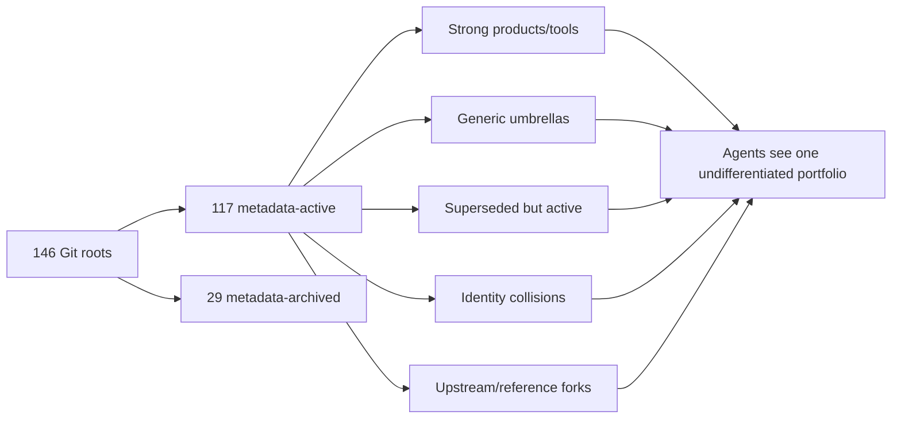
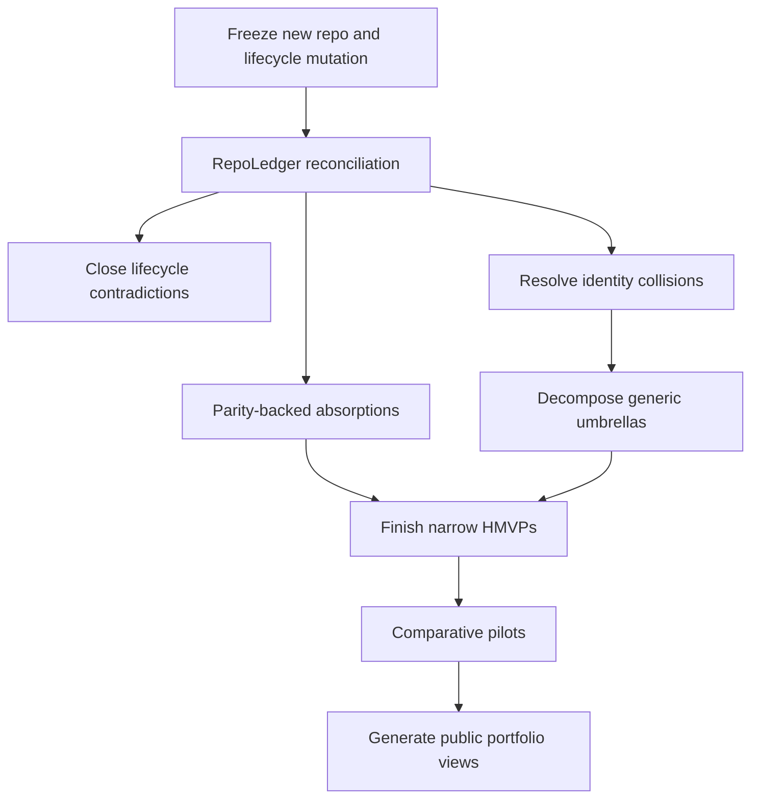
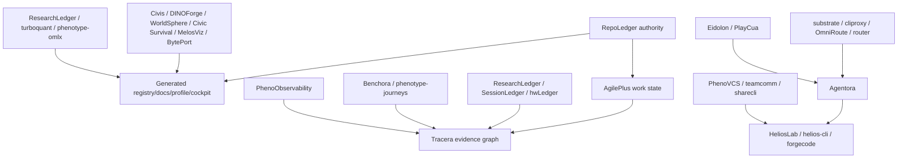

# KooshaPari Portfolio — Before, Transition, After

## Before

- 146 owner repositories
- 117 not archived in GitHub metadata
- 29 archived
- 34 private
- 108 root-document reviews in this pass
- competing lifecycle and authority claims
- products, forks, generated surfaces, generic shelves, and historical repositories mixed in one work queue

## Transition

Work lanes:

- one canonical completion;
- one consolidation;
- one forensic identity;
- one external blocker.

## After

| Class | Count | Standing work policy |
|---|---:|---|
| Managed | 63 | May receive normal feature/maintenance agents |
| Incubator or forensic hold | 15 | One bounded experiment/decision; promote or retire |
| Frozen reference/showcase | 13 | No standing feature work |
| Retire after closure gate | 55 | Migration/consumer/provenance work only |
| **Active agent-owned** | **78** | Portfolio capacity-planning number |

## Count philosophy

The raw GitHub count may remain above the active target because immutable archives and attributed forks are cheap and valuable. The operational problem is solved when archived/reference repositories disappear from normal agent planning and all active authorities are unambiguous.

## chat1-portfolio-audit-2026-09-05 batch delta

Per `chat1-portfolio-audit-2026-09-05/outcome-gap-table-20260909.md`,
this batch covered disposition-register rows 71 (PhenoProc),
76 (phenotype-gateway), and 77 (phenotype-gfx). Operator authorization
on all eight blocker packets closed during this batch (BP-GW-01,
BP-GW-02, BP-PROC-01, BP-PROC-02, BP-PROC-03, BP-GFX-01, BP-GFX-02
partial, BP-ALL-01).

| Register row | Repo | Before (this batch) | After (this batch) | Closed blocker packets | Open work-packages (separate gates) |
|---|---|---|---|---|---|
| 76 | `phenotype-gateway` | active, archive_normalize pending, `phenotype-router` v0.2.0 successor declared (ADR-050/051) + `HexaKit/crates/phenotype-router/` thin pointer | **archived** (`isArchived: true`, push 2026-09-09); successor parity verified live | BP-GW-01 (archive executed), BP-GW-02 (pre-archive evidence: stale-link scan, router capability-surface check) | none from this batch |
| 77 | `phenotype-gfx` | active, incubator, 90-day consumer gate **unmet** (no two-game consumer named), multiple inherited `main` defects breaking hosted required checks | 2 PRs open in DRAFT awaiting inherited check repairs; **PR20** extended with rustfmt follow-up to clear 5 inherited checks (Lint & Format / Rust on macos+ubuntu+windows / ci/lint); **PR21** created to clear RUSTSEC-2024-0437 (protobuf 2.x CVE-2025-53605); consumer search confirmed **no two-game consumer evidence exists in repo, sister repos, or chat1-p0 docs** | BP-GFX-01 (consumer search escalated — `bp-gfx-01-evidence-20260909.md`), BP-GFX-02 (partial: rustfmt follow-up; remaining 9 inherited defects logged as separate WPs in `bp-gfx-02-evidence-20260909.md`) | Cargo Deny license drift, Trunk launcher, cbindgen missing for msrv+coverage, ruff Python, Mergify/Infisical, Scorecard workflow, Sonar, MSRV, 90-day consumer gate fallback ("return modules to product owners") |
| 71 | `PhenoProc` | active, canonical, 5-crate workspace per ADR-003; `pheno-proc-uds` had no in-workspace consumer; SPEC.md §9 UDS targets unexercised; 8 stale dependabot PRs queued | **PR75** extended with 6 integration tests (BP-PROC-01) + `criterion` benchmark harness covering 2 of 4 SPEC.md §9 UDS targets (BP-PROC-03); per-PR triage on #65–#73 confirmed all 7 dependabot bumps are valid non-superseded (BP-PROC-02, no bulk close); `lru 0.18.4` use-after-free RUSTSEC-2026-0253 discovered as pre-existing trunk-applied change | BP-PROC-01 (integration tests added and PASS 6/6), BP-PROC-02 (per-PR triage done), BP-PROC-03 (bench harness added, SPEC.md §9 latency target **not met at 65us**, recorded honestly not masked) | WP-PROC-G5-01 (UdsDatagram), WP-PROC-G5-02 (SCM_RIGHTS fd-pass), WP-PROC-G5-03 (core_benchmark.rs is a stub), WP-PROC-G5-04 (phenotype-dag has no benches), G2 Windows, G3 sentinel/reap/limits, G6 release/install, G7 inherited Cargo Deny / TruffleHog / Trunk / Mergify / Infisical |

PR state at end of batch:

- `KooshaPari/phenotype-gfx#20` — OPEN DRAFT MERGEABLE REVIEW_REQUIRED, head `4e1bd58…`, +48/-14, 1 file (`src/streaming_io.rs` + `bindings/c_api.rs` rustfmt)
- `KooshaPari/phenotype-gfx#21` — OPEN DRAFT MERGEABLE REVIEW_REQUIRED, head `0d072be…`, +148/-307, 2 files (`Cargo.toml`, `Cargo.lock`)
- `KooshaPari/PhenoProc#75` — OPEN DRAFT MERGEABLE REVIEW_REQUIRED, head `a5fb5e58…`, +2975/-146, 42 files

Aggregate gate posture after batch:

- `phenotype-gateway` — **archived**; closure chain complete
- `phenotype-gfx` — G0/G2/G3 partial+closed; G1 unmet; G4 pending inherited check repairs; **not closed**
- `PhenoProc` — G0/G2 closed; G1/G2/G3/G4/G5/G6 partial or unmet; **not closed**

All evidence persisted under
`/Users/kooshapari/Downloads/chat1-portfolio-audit-2026-09-05/`:
`outcome-gap-table-20260909.md` (parent reconciliation),
`bp-*-evidence-20260909.md` (8 BP evidence files),
`gfx-pr-body.md` / `gfx-pr-protobuf-body.md` / `phenoproc-pr75-body.md`
(PR bodies pushed via `gh pr edit`),
`gfx-pr20-audit-comment.md` / `phenoproc-pr75-audit-comment.md`
(audit comments posted to PR conversation tabs),
and 14 `*-20260908.log` / `*-20260909.log` re-run artifacts
(`cargo test`, `cargo check`, `cargo clippy`, `cargo bench`, `cargo audit`,
`cargo fmt --check`).
